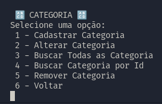

<p align="center">
  <h1 align="center">🛍️ LojaRoupas 👗<h3 align="center">Aplicativo de gerenciamento de vendas de uma loja de roupas, solicitado pelo professor Everton, matéria de POO, em 2023/1.</h3>
</p>

## ScreenShot

##### Menu Inicial

  

##### Menu Cliente

  

##### Menu Categoria

  

##### Menu Produto

  
  
##### Menu Venda
  

## Como Utilizar?

⚠️ Certifique-se se você tem o .NET 6.0 instalado ⚠️

### Instalar .NET 6.0 Linux

#### Fedora

Comando para instalar o .NET 6.0 SDK

```
sudo dnf install dotnet-sdk-6.0
```

Comando para instalar o .NET 6.0 RunTime

```
sudo dnf install dotnet-runtime-6.0
```

### Como Executar o Programa?

clone o repositório para a sua máquina

```
git clone https://github.com/pedrojosawczuk/LojaRoupas.git
```

Entre na pasta com o repositório local

```
cd LojaRoupas
```

Para compilar e executar o código utilize o seguinte comando

```
dotnet run --project LojaRoupas/LojaRoupas.csproj
```

### Alunos: Luana Copetti, Jonathan Marinho, Pedro J de O Sawczuk